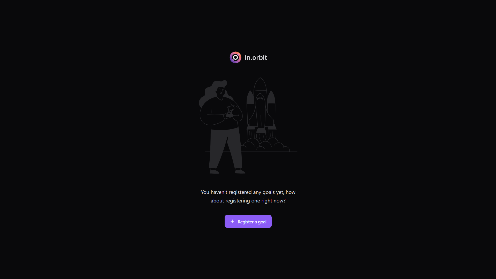

<h1 align="center">
    
</h1>

<p align="center">
  <a href="#-screenshots">Screenshots</a>&nbsp;&nbsp;&nbsp;|&nbsp;&nbsp;&nbsp;
  <a href="#-about">About</a>&nbsp;&nbsp;&nbsp;|&nbsp;&nbsp;&nbsp;
  <a href="#-project">Project</a>&nbsp;&nbsp;&nbsp;|&nbsp;&nbsp;&nbsp;
  <a href="#-technologies">Technologies</a>&nbsp;&nbsp;&nbsp;|&nbsp;&nbsp;&nbsp;
  <a href="#-how-to-run">How to run</a>
</p>

## 📷 Screenshots

### Home
<p align="center">
  
</p>

### Add Goal
<p align="center">
  
</p>

### Weekly Goals
<p align="center">
  
</p>

## 🪐 About

In Orbit is your best assistant for efficient goal management. It helps you set weekly goals, track their frequency, and ensures an organized path to achieving your objectives.

## 🚀 Project

🌟 Situation:

Managing personal goals effectively can be a daunting task. People often struggle to stay organized and track their progress. In Orbit addresses this issue by providing a streamlined system for setting, tracking, and managing weekly goals, helping users stay on track and achieve their objectives efficiently.

🎯 Task:

Develop a goal management application that:

- Allows users to register new goals effortlessly.
- Provides an accessible list of all previously set goals.
- Enables effective management of weekly goals.
- Tracks the frequency of goal completions.

🚀 Action:

To achieve these goals, the following steps were taken:

- Design & User Experience: Crafted a clean, intuitive interface using Tailwind CSS, ensuring a user-friendly experience that encourages consistent goal management.
- Goal Registration & Management: Implemented seamless goal registration and management functionalities using React Hook Form for smooth data handling and Zod for form validation, ensuring users can easily set and update their goals.
- State Management & Data Synchronization: Leveraged React Query for efficient server state handling and data synchronization, providing real-time updates on goal progress and statistics.
- Technology Stack: Chose React.js with Vite for fast and efficient development, combined with TypeScript for robust type-checking and maintainability.
- Tracking & Metrics: Implemented features to monitor goal completion frequency and generate progress metrics using custom hooks, offering valuable insights to users about their goal achievement patterns.

🏆Result:

In Orbit successfully delivered:

- Efficient Goal Management: Users could easily register, manage, and track their weekly goals, leading to improved organization and productivity.
- Comprehensive Progress Tracking: The application provided detailed insights into goal completion patterns, helping users stay motivated and on track.
- Positive Feedback: The intuitive design and reliable performance received praise, contributing to increased user engagement and satisfaction.
- Scalable and Maintainable Codebase: The use of React.js with Vite and TypeScript ensured the app is scalable and easy to maintain, laying a strong foundation for future enhancements and features.

## 🔧 Technologies

Throughout these projects, I have utilized a variety of technologies and tools, including:

- [React.js](https://react.dev/)
- [Vite](https://vitejs.dev/)
- [TypeScript](https://www.typescriptlang.org/)
- [Tailwind CSS](https://tailwindcss.com/)
- [React Query](https://tanstack.com/query/latest/docs/framework/react/overview)
- [React Hook Form](https://www.react-hook-form.com/)
- [Zod](https://zod.dev/)
- [Day.js](https://day.js.org/)
- [Lucide React](https://lucide.dev/guide/packages/lucide-react)
- [Biome](https://biomejs.dev/)

## 😊 How to run

Before starting, you need to have [Git](https://git-scm.com) and [Node](https://nodejs.org/en/) installed on your machine.

```sh
- Clone this repo:
$ git clone https://github.com/marcelopajr/in-orbit-web

- Enter directory:
$ cd in-orbit-web

- Install dependencies:
$ npm install

- Launch the app:
$ npm run dev
```

⚠️ You also need to run the [in-orbit-api](https://github.com/marcelopajr/in-orbit-api) if you want to test adding a goal and all the features.

Have fun!
